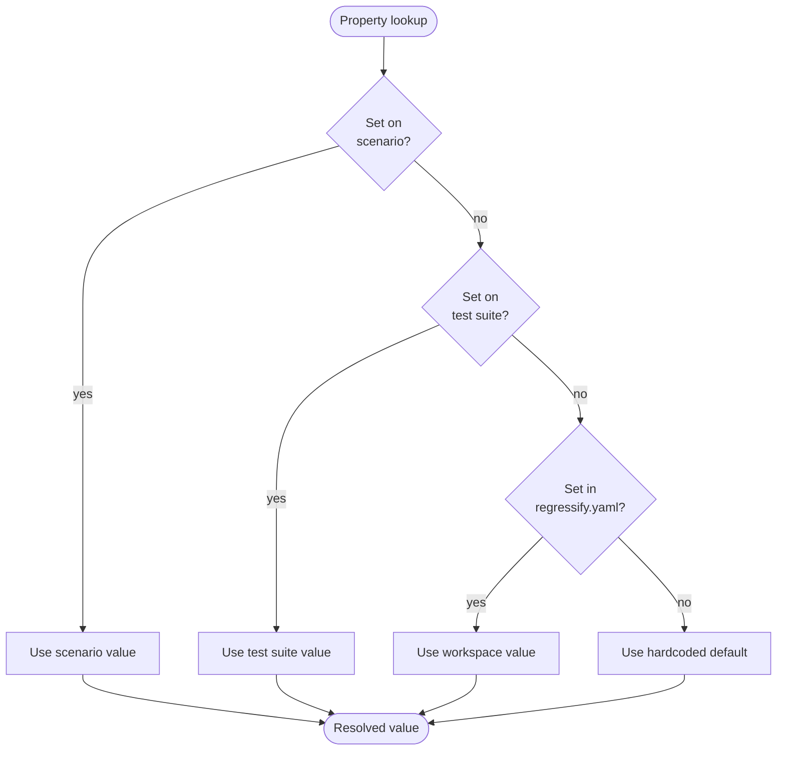
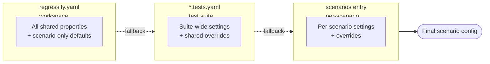

# Regressify properties

This document is the authoritative reference for every configuration property
recognized by Regressify. It records:

- Where each property may be set (workspace, test suite, scenario)
- The default value applied when no level provides one
- The order in which values are resolved

If you add or remove a property in the codebase, **update this document at the
same time**.

## Configuration levels

Regressify resolves every property by walking three optional configuration
levels, from most specific to least specific, and falling back to a hardcoded
default when none of them set the value.

| Level      | File                                                                        | Scope                            |
| ---------- | --------------------------------------------------------------------------- | -------------------------------- |
| Scenario   | An entry under `scenarios:` in a `*.tests.{yaml,yml,json}` file             | One scenario                     |
| Test suite | The top-level object of a `*.tests.{yaml,yml,json}` file in `visual_tests/` | All scenarios in that suite      |
| Workspace  | `regressify.yaml` (or `regressify.yml`) at the workspace root               | All test suites in the workspace |

The workspace file is **optional**. When it is missing, the cascade simply
skips that level.

## Resolution order





> Boolean properties use `typeof value === 'boolean'` checks rather than `??`
> so that an explicit `false` always wins over a fallback `true`. Properties
> that follow this stricter rule are marked **strict-bool** in the table.

## Property reference

The "Levels" column lists every level that accepts the property. The "Default"
column shows the value Regressify uses when no level sets it.

| Property              | Type                                  | Default                  | Levels                     | Notes                                                                                                                                                                                                    |
| --------------------- | ------------------------------------- | ------------------------ | -------------------------- | -------------------------------------------------------------------------------------------------------------------------------------------------------------------------------------------------------- |
| `urlReplacements`     | `ReplacementModel[]`                  | —                        | workspace, suite           | Currently declared but not consumed by the runtime. Reserved for future use; URL replacements are read from `common/_replacement-profiles.yaml`.                                                         |
| `hideSelectors`       | `string[]`                            | `[]`                     | workspace, suite, scenario | Final empty-array default applied in `createScenario`.                                                                                                                                                   |
| `removeSelectors`     | `string[]`                            | `[]`                     | workspace, suite, scenario | Final empty-array default applied in `createScenario`.                                                                                                                                                   |
| `useCssOverride`      | `boolean`                             | `true`                   | workspace, suite, scenario | **strict-bool**                                                                                                                                                                                          |
| `cssOverridePath`     | `string`                              | `common/_override.css`   | workspace, suite, scenario | Final default applied in `createScenario`.                                                                                                                                                               |
| `viewportsPath`       | `string`                              | `common/_viewports.yaml` | workspace, suite           | Path is relative to the working directory.                                                                                                                                                               |
| `debug`               | `boolean`                             | `false`                  | workspace, suite           | When `true` and not running on CI, Backstop launches a visible browser window.                                                                                                                           |
| `asyncCaptureLimit`   | `number`                              | `5`                      | workspace, suite           | Forwarded to Backstop.                                                                                                                                                                                   |
| `asyncCompareLimit`   | `number`                              | `50`                     | workspace, suite           | Forwarded to Backstop.                                                                                                                                                                                   |
| `browser`             | `'chromium' \| 'firefox' \| 'webkit'` | `chromium`               | workspace, suite           | Forwarded as `engineOptions.browser`.                                                                                                                                                                    |
| `misMatchThreshold`   | `number`                              | `0.1`                    | workspace, suite, scenario | Lower = stricter pixel comparison.                                                                                                                                                                       |
| `postInteractionWait` | `number`                              | `1`                      | workspace, suite, scenario | Milliseconds Backstop waits after interactions.                                                                                                                                                          |
| `viewportNames`       | `string \| string[]`                  | — (use all viewports)    | workspace, suite, scenario | Filters `viewportsPath` entries by `label`.                                                                                                                                                              |
| `bypassCsp`           | `boolean`                             | `false`                  | workspace, suite, scenario | **strict-bool** Enables Chromium-only CSP bypass in the Playwright `onBefore` hook. Required to use `page.addStyleTag`/`addScriptTag` against pages with strict CSP. Has no effect on Firefox or WebKit. |
| `ignoreSslErrors`     | `boolean`                             | `true`                   | workspace, suite           | **strict-bool** Forwarded as `engineOptions.ignoreHTTPSErrors`.                                                                                                                                          |
| `state`               | `string`                              | —                        | workspace, suite           | Storage-state file name (under the state directory). When the file exists it is forwarded as `engineOptions.storageState`.                                                                               |
| `delay`               | `number`                              | `1000`                   | workspace, scenario        | Milliseconds Backstop waits before capturing. Skips the test-suite level.                                                                                                                                |
| `cookiePath`          | `string`                              | `common/_cookies.yaml`   | workspace, scenario        | Final default applied in `createScenario`. Skips the test-suite level.                                                                                                                                   |
| `jsOnReadyPath`       | `string`                              | `common/_on-ready.js`    | workspace, scenario        | Final default applied in `createScenario`. Skips the test-suite level.                                                                                                                                   |
| `noScrollTop`         | `boolean`                             | `false`                  | workspace, scenario        | When `true`, suppresses the auto scroll-to-top before capture.                                                                                                                                           |
| `requiredLogin`       | `boolean`                             | `false`                  | workspace, scenario        | The CLI flag `--requiredLogin` forces this `true` for every scenario regardless of any level.                                                                                                            |

### Scenario-only properties

These properties only make sense for an individual scenario, so they are not
accepted at the test-suite or workspace level.

| Property          | Type                 | Default                            | Notes                                                                                                             |
| ----------------- | -------------------- | ---------------------------------- | ----------------------------------------------------------------------------------------------------------------- |
| `url`             | `string`             | —                                  | **Required**. The page to capture. URL replacements are applied unless running with `--ref`.                      |
| `label`           | `string`             | `"{index} of {total}: {pathname}"` | Used in report filenames; restricted to `^[a-z0-9_-]+$` by the schema.                                            |
| `description`     | `string`             | —                                  | Free-form description shown in the report.                                                                        |
| `id`              | `string`             | —                                  | Stable identifier used by `needs` to inherit actions from another scenario. Restricted to `^[a-z0-9_-]+$`.        |
| `needs`           | `string \| string[]` | —                                  | Reference one or more scenario `id`s to inherit their `actions`. Resolved recursively (max depth 100).            |
| `actions`         | `Action[]`           | —                                  | Sequence of interactions performed before capture. See the action types defined in `common/test-schema.json`.     |
| `selectors`       | `string \| string[]` | —                                  | Selectors to capture. When omitted Backstop captures the document. Use `"viewport"` to capture the viewport size. |
| `clickSelector`   | `string`             | —                                  | Backstop click-before-capture shortcut.                                                                           |
| `cssOverridePath` | `string`             | inherited from cascade             | Per-scenario override of the cascade default.                                                                     |
| `cookiePath`      | `string`             | inherited from cascade             | Per-scenario override of the cascade default.                                                                     |
| `jsOnReadyPath`   | `string`             | inherited from cascade             | Per-scenario override of the cascade default.                                                                     |

### Test-suite-only properties

| Property    | Type              | Notes                                                  |
| ----------- | ----------------- | ------------------------------------------------------ |
| `scenarios` | `ScenarioModel[]` | **Required**. Array of scenarios to run for the suite. |

### Workspace-only behavior

The workspace file has no required properties. Every property listed above is
optional, and an empty `regressify.yaml` is equivalent to no file at all.

## Examples

### `regressify.yaml`

```yaml
# Workspace-wide defaults. Any value here applies to every test suite
# unless overridden at the suite or scenario level.
browser: chromium
bypassCsp: true
ignoreSslErrors: true
asyncCaptureLimit: 5
asyncCompareLimit: 50
misMatchThreshold: 0.1
postInteractionWait: 500
delay: 1500
viewportNames:
  - desktop
  - tablet
hideSelectors:
  - '#cookie-banner'
  - '.live-chat-widget'
```

### Test suite (`visual_tests/marketing.tests.yaml`)

```yaml
# Suite-level overrides for one set of scenarios.
browser: chromium
misMatchThreshold: 0.05  # stricter than the workspace default
viewportNames: desktop   # narrows the workspace list

scenarios:
  - url: https://example.com/
    label: home

  - url: https://example.com/pricing
    label: pricing
    delay: 3000             # scenario override (workspace default is 1500)
    bypassCsp: false        # scenario override (workspace default is true)
    hideSelectors:
      - '#promo-banner'
```

## Where this is implemented

| Concern                  | File                                                                                   |
| ------------------------ | -------------------------------------------------------------------------------------- |
| Type definitions         | [src/types.ts](../src/types.ts) (`WorkspaceConfig`, `TestSuiteModel`, `ScenarioModel`) |
| Workspace file loading   | `getWorkspaceConfig()` in [src/config.ts](../src/config.ts)                            |
| Cascade resolution       | `getScenarios()` and `getConfigs()` in [src/config.ts](../src/config.ts)               |
| Final scenario defaults  | [src/scenarios.ts](../src/scenarios.ts)                                                |
| JSON schema (workspace)  | [common/regressify-schema.json](../common/regressify-schema.json)                      |
| JSON schema (test suite) | [common/test-schema.json](../common/test-schema.json)                                  |
| VS Code schema mapping   | [src/initialization/auto-suggestion.ts](../src/initialization/auto-suggestion.ts)      |
