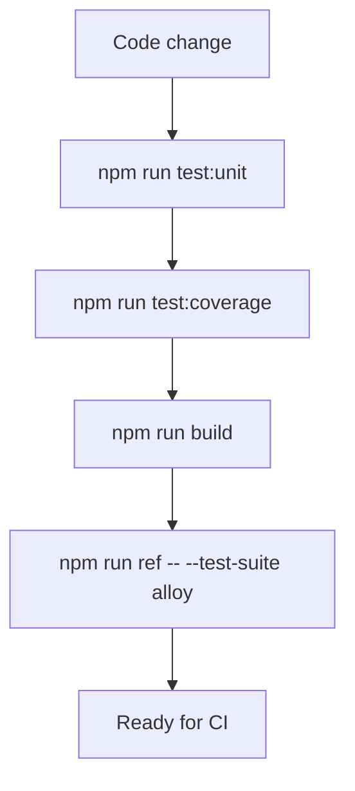
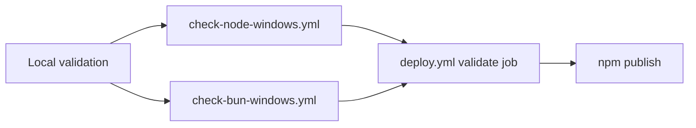

# Regressify Unit Tests

This document explains how the automated test system is organized, why it was
designed this way, and how to maintain it without weakening its signal.

Use this file as the primary maintenance reference for:

- local test commands
- coverage expectations
- test ownership by module
- how to interpret failures
- what CI must validate before publishing to npm

## Goals

The test system exists to protect the logic that is easiest to break during
maintenance:

- configuration loading and cascade resolution
- scenario dependency expansion
- path and file-system behavior across Windows-friendly paths
- report post-processing and snapshot hashing
- initialization helpers that patch project files
- command routing that decides which Backstop flow runs

The suite is intentionally biased toward deterministic unit tests over large
fixture-heavy integration tests. When behavior can be expressed as a pure helper
or a small injected seam, test that directly.

## Why Vitest

Vitest was chosen because this repository is ESM-first and the runtime already
leans heavily on module imports, file-system access, and process-level behavior.

Vitest fits this repo well because it gives us:

- native ESM support without adding a second compilation layer
- fast test startup for a small CLI-oriented codebase
- easy mocking of `fs`, `process`, dynamic imports, and module boundaries
- built-in coverage using V8 instead of a separate Istanbul transform layer
- a watch mode that is light enough for iterative refactors

## Validation layers

There are three distinct validation layers. They solve different problems and
should not be treated as interchangeable.

| Layer               | Command                                      | Purpose                                                                                  | Typical failure meaning                                                                      |
| ------------------- | -------------------------------------------- | ---------------------------------------------------------------------------------------- | -------------------------------------------------------------------------------------------- |
| Fast unit suite     | `npm run test:unit`                          | Validate behavior and regressions quickly while editing                                  | A specific code path changed behavior or a mock assumption is stale                          |
| Coverage gate       | `npm run test:coverage` or `npm run test:ci` | Ensure important branches stay exercised                                                 | New logic was added without enough tests, or a file moved below the minimum signal threshold |
| Smoke runtime check | `npm run ref -- --test-suite alloy`          | Validate the actual CLI, config assembly, Playwright wiring, and Backstop reference flow | A real runtime integration path broke even if isolated unit tests still pass                 |

## Command reference

| Command                             | When to use it                                  | Notes                                                  |
| ----------------------------------- | ----------------------------------------------- | ------------------------------------------------------ |
| `npm run test:unit`                 | Normal development loop                         | Runs the whole unit suite once                         |
| `npm run test:unit:watch`           | TDD or local iteration                          | Re-runs tests on change                                |
| `npm run test:coverage`             | Before merging bigger changes                   | Prints the full coverage table and enforces thresholds |
| `npm run test:ci`                   | CI and release gates                            | Same threshold enforcement with a terser reporter      |
| `npm run build`                     | Before publishing or after type-heavy refactors | Confirms the TypeScript project still compiles         |
| `npm run ref -- --test-suite alloy` | Smoke validation                                | Generates reference snapshots for the checked suite    |

## Coverage policy

The current global thresholds are defined in `vitest.config.ts`.

| Metric     | Minimum |
| ---------- | ------- |
| Lines      | `94`    |
| Statements | `94`    |
| Functions  | `94`    |
| Branches   | `90`    |

These numbers are intentionally high enough to stop silent erosion, while still
allowing a small amount of wrapper code or defensive error handling to remain
less than perfect.

Do not lower thresholds just to get a branch through CI. If a threshold becomes
unrealistic, document exactly why, identify the affected file, and change the
threshold deliberately.

## Test execution model

## Test layout

The `tests/` directory is organized by production module, with a shared utility
file for temporary workspaces and file creation.

| File                           | Focus                                                                 |
| ------------------------------ | --------------------------------------------------------------------- |
| `tests/test-utils.ts`          | Temporary workspace creation, workspace switching, helper file writes |
| `tests/index.test.ts`          | CLI command routing                                                   |
| `tests/helpers.test.ts`        | Generic CLI and file helpers                                          |
| `tests/replacements.test.ts`   | Replacement profile resolution and URL rewriting                      |
| `tests/state.test.ts`          | State path helpers                                                    |
| `tests/scenarios.test.ts`      | Scenario creation defaults                                            |
| `tests/config.loaders.test.ts` | Workspace config loading, suite discovery, file loading               |
| `tests/config.needs.test.ts`   | `needs` expansion and cycle detection                                 |
| `tests/config.cascade.test.ts` | Final config cascade and Backstop config assembly                     |
| `tests/snapshot.test.ts`       | Report hashing, cleanup, summary generation                           |
| `tests/install.test.ts`        | Playwright browser metadata lookup and installation flow              |
| `tests/initialization.test.ts` | Project bootstrap helpers and file patching                           |
| `tests/regressify.test.ts`     | Compare report patching and Backstop command orchestration            |

## Module-to-test mapping

Use this table when changing runtime behavior. If you touch one of these files,
start by updating the matching test file.

| Production module         | Primary tests                                                                                | Main behavior under test                                                                |
| ------------------------- | -------------------------------------------------------------------------------------------- | --------------------------------------------------------------------------------------- |
| `src/index.ts`            | `tests/index.test.ts`                                                                        | Command dispatch for `init`, `install`, `ref`, `approve`, `test`, `snapshot`, `version` |
| `src/config.ts`           | `tests/config.loaders.test.ts`, `tests/config.needs.test.ts`, `tests/config.cascade.test.ts` | CLI argument interpretation, workspace config loading, scenario cascade, CI behavior    |
| `src/replacements.ts`     | `tests/replacements.test.ts`                                                                 | Replacement profile lookup and URL generation                                           |
| `src/snapshot.ts`         | `tests/snapshot.test.ts`                                                                     | Hashing, report rewriting, cleanup, html summary generation                             |
| `src/install.ts`          | `tests/install.test.ts`                                                                      | Browser metadata discovery and Playwright install process                               |
| `src/regressify.ts`       | `tests/regressify.test.ts`                                                                   | HTML patching and Backstop orchestration                                                |
| `src/scenarios.ts`        | `tests/scenarios.test.ts`                                                                    | Scenario defaults and shaping                                                           |
| `src/state.ts`            | `tests/state.test.ts`                                                                        | State file and path helpers                                                             |
| `src/initialization/*.ts` | `tests/initialization.test.ts`                                                               | Bootstrap file creation, schema wiring, migrations, and project patching                |

## Test design rules

When adding or updating tests, keep the suite deterministic and local.

- Prefer temporary workspaces over editing repository files directly.
- Prefer injected dependencies and exported pure helpers over broad mocking.
- When a bug comes from a top-level workflow, add one narrow regression test for that exact route.
- If a helper has meaningful fallback behavior, cover both the happy path and the fallback path.
- When booleans represent explicit configuration, test `false` as carefully as `true`.
- For path-sensitive logic, cover both normal and Windows-escaped path forms when the runtime supports both.

## Failure interpretation

Different failures imply different repair strategies.

| Failure type                                | What it usually means                                  | What to inspect first                                                            |
| ------------------------------------------- | ------------------------------------------------------ | -------------------------------------------------------------------------------- |
| Single unit test failure                    | A local behavior changed                               | The production module paired with that test file                                 |
| Many failures in one module group           | A shared helper or common fixture changed              | The shared helper imported by the failing tests                                  |
| Coverage threshold failure with green tests | New logic is untested                                  | The coverage table and uncovered branch lines                                    |
| `npm run build` failure                     | Type contracts, imports, or emitted signatures drifted | The first TypeScript error in the build output                                   |
| Smoke command failure                       | Runtime integration broke                              | `src/index.ts`, `src/config.ts`, `src/regressify.ts`, Playwright/Backstop wiring |

## How to add tests for new behavior

When adding a new runtime feature:

1. Identify the owning module that directly decides the behavior.
2. Add or extend the nearest test file instead of creating a broad new fixture tree by default.
3. Write at least one success-path test and one failure, fallback, or explicit-override test.
4. If the feature changes CLI routing or config cascade, add a regression test for that exact path.
5. Run `npm run test:coverage` before considering the change complete.

## Release gate policy

Publishing to npm is intentionally gated by explicit validation jobs.

The release workflow in `.github/workflows/deploy.yml` now requires all of the
following to pass before `npm publish` runs:

- dependency installation
- `npm run build`
- `npm run test:ci`
- `npm run install:browsers`
- `npm run ref -- --test-suite alloy`

The Windows check workflows mirror the same sequence so regressions show up on
regular pushes before a release branch publish attempt.

## Maintenance checklist

When changing behavior in this repository, use this checklist:

1. Update the nearest unit tests.
2. Run `npm run test:unit`.
3. Run `npm run test:coverage`.
4. Run `npm run build`.
5. Run `npm run ref -- --test-suite alloy` if the change affects runtime orchestration, config, Backstop, or Playwright.
6. Update `docs/properties.md` when configuration behavior changes.
7. Update this document when the testing strategy, commands, thresholds, or workflow gates change.
